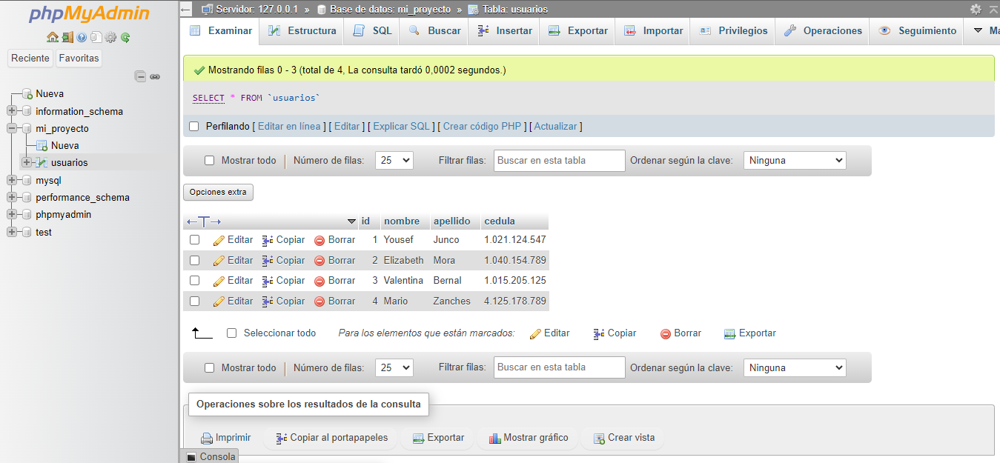

<h1>Taller 10: Yousef Junco</h1>

<h2>Informacion</h2>

Curso: Full Stack Básico Grupo 1

Profesor: Cristian Patio

<h2>Punto 1:</h2>

<h2>Punto 2:</h2>

<h2>Punto 3:</h2>

<h2>Punto 4:</h2>

<h2>Punto 5-6-7:</h2>
<h3>5 - Base de datos</h3>
