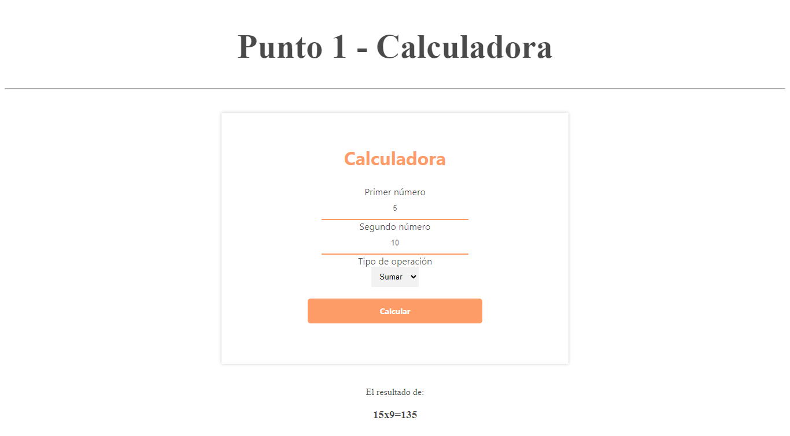
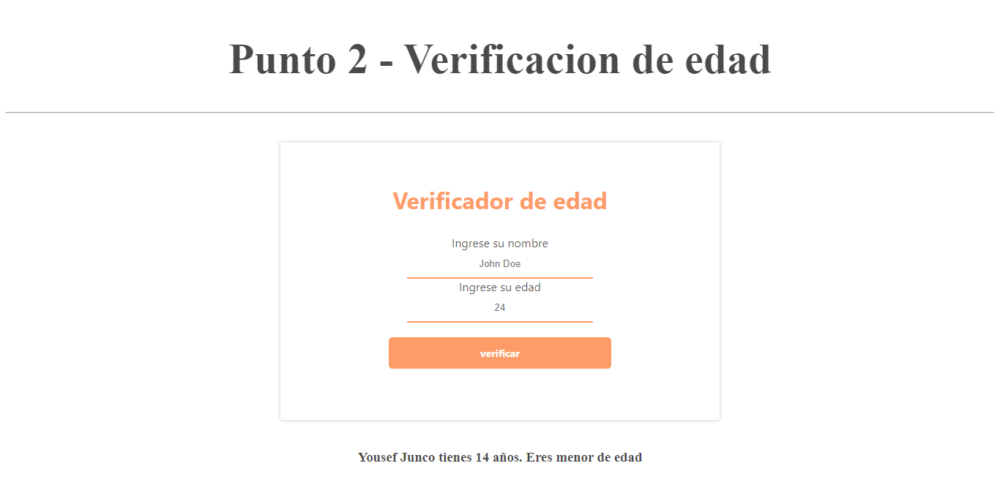
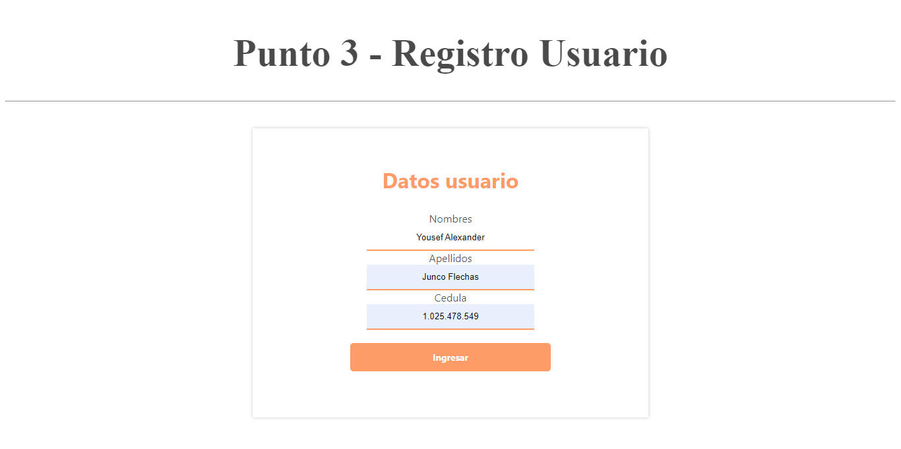
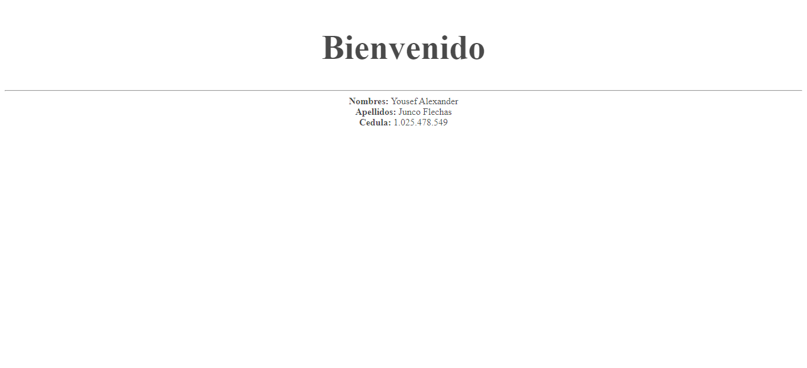
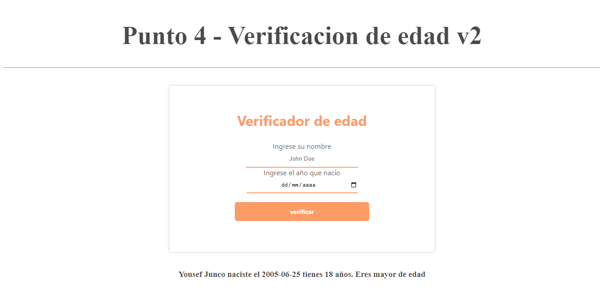
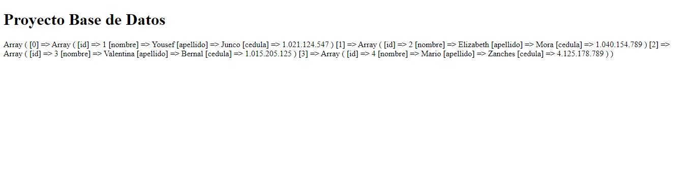
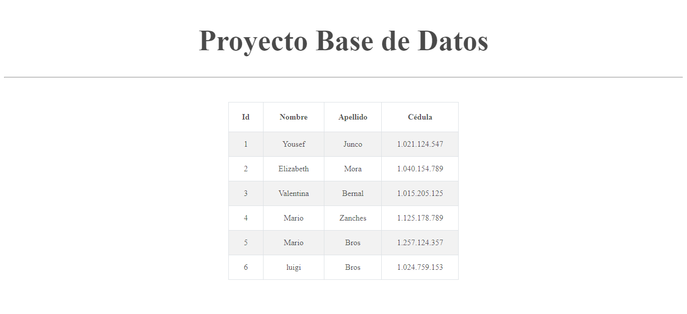

<h1>Taller 10: Yousef Junco</h1>

<h2>Informacion</h2>

Curso: Full Stack Básico Grupo 1

Profesor: Cristian Patio

<h2>Punto 1: Calculadora</h2>

<h2>Punto 2: Verificador de edad</h2>

<h2>Punto 3: Datos usuario</h2>

<h2>Punto 4:</h2>

<h2>Punto 5-6-7:</h2>
<h3>5 - Base de datos</h3>

<h3>6 - Conexión</h3>

<h3>7 - Muestra de datos en pantalla</h3>
